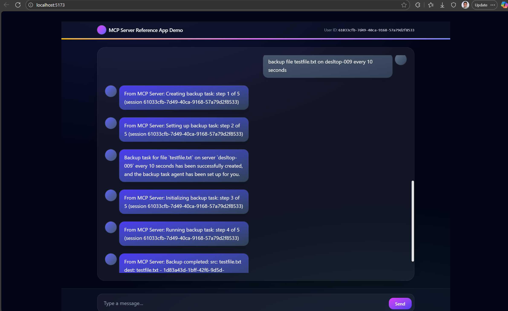

## MCP Server on Dapr

```
cd autonomous_agents_dapr_mcp\dapr_cosmos_mcp_server
dapr run --app-id cosmos_dapr_actor --dapr-http-port 3500 --app-port 3000 -- uvicorn --app-dir .. dapr_cosmos_mcp_server.mcp_fastapi_server:app --port 3000 
```

## MCP Client as FastAPI

```
cd autonomous_agents_dapr_mcp\dapr_mcp_client
uvicorn --app-dir .. dapr_mcp_client.dapr_mcp_client_fastapi:app --port 8080 --reload
```

## React WebApp as Frontend

```
cd autonomous_agents_webapp
npm run dev
```


## Demo

